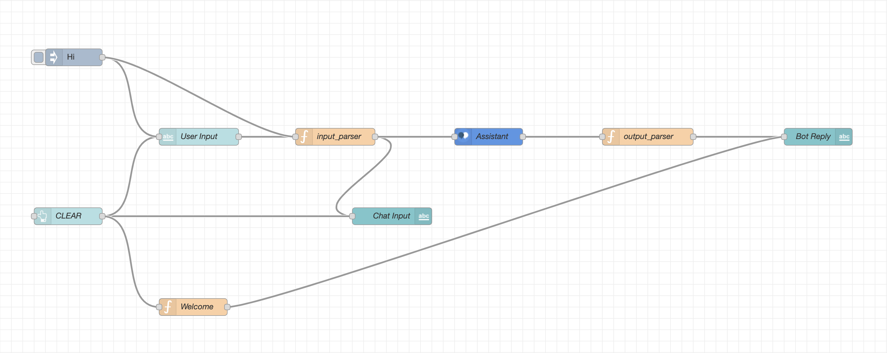

# Intelligent Customer Help Desk with Smart Document Understanding

## Project Scope

The scope of the project is to develop a smart chatbot focusing on customer requirements such as providing appropriate instructions or help or advise on different functions of the device user possesses. In the current scenario, the chatbots build are too naive to be able to interact outside their predetermined list of questions, to overcome this we are going to build a smart chatbot based solution that will be able to learn on it's own about various important information about the devices and when asked a question be able to provide the user with the relevant information without having to involve the human in the loop. This is a great improvement from the existing technology as it not only will be able to tackle various sets of questions but also will be able to get better at answering them with time.

## Project Overview

The goal of this project is to build an intelligent chatbot for businesses to scale faster without using excess human resources and for consumers to get interactive answers without having to read a user manual using a chatbot.
The bot created in this project is based on the OnePlus user manual of their latest smart-phone OnePlus 8 Pro.

The node-red flow of my project is as follows:

#### Project Links

1. Chatbot Link: [One Plus 8 Customer Chatbot](https://smart-doc-understanding.eu-gb.mybluemix.net/ui/#!/0?socketid=Tsx4fXG1K1MxCHoyAAAv)
2. Project Video: [Demonstration](https://youtu.be/Pb1gtQGxnQc)
3. Testimonial Video: [Thank you](https://youtu.be/v1yUOzzkuDg)
